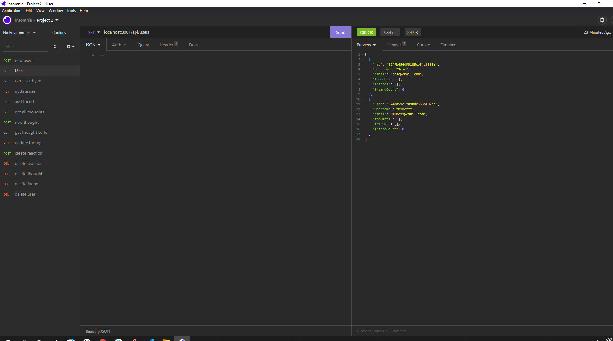
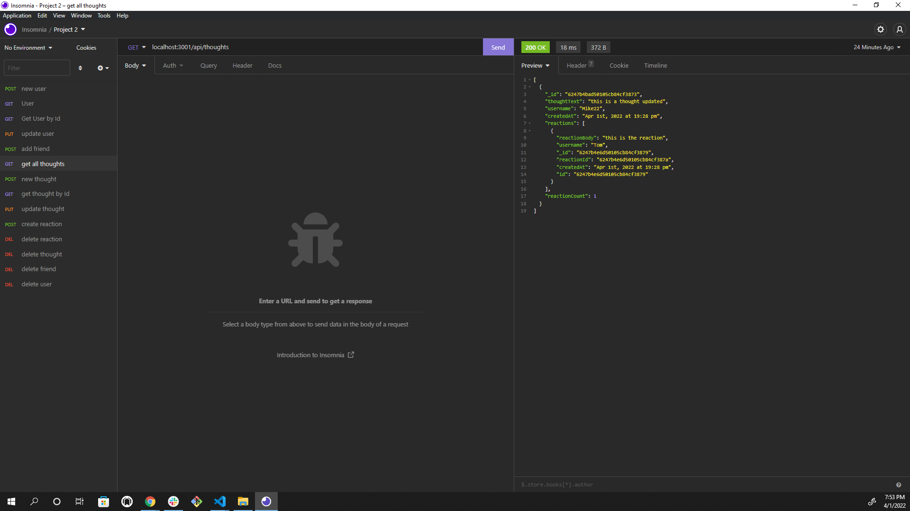
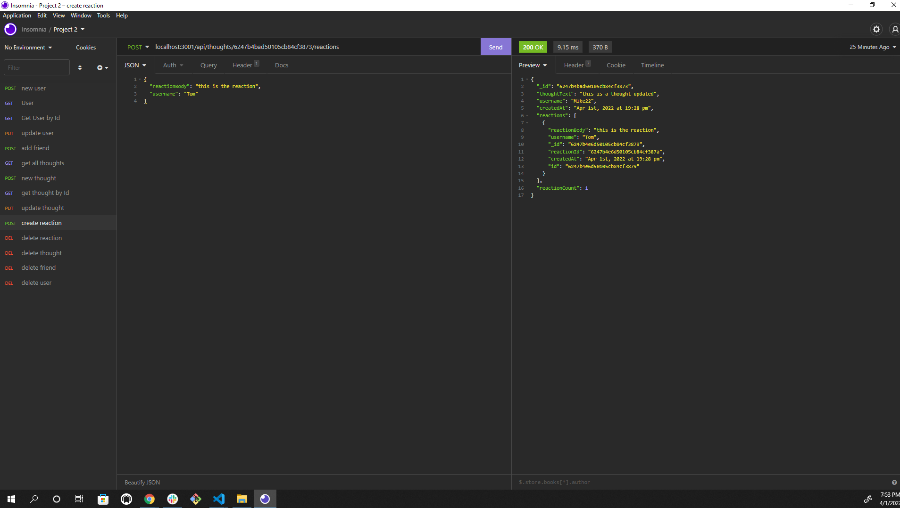

# Gordon-sn-api

## Description

This is the back end to a social network site allowing creation/deletion of users, friends, thoughts, and reactions, as well as the ability to update users, and thoughts. This application uses Express.js for routing, a MongoDB database, and the Mongoose ODM.

## Table of Contents

\*[Installation](#installation)

\*[Usage](#usage)

\*[License](#license)

\*[Contributing](#contributing)

\*[Tests](#tests)

\*[Questions](#questions)

## Installation

Clone the repo and run npm install to load all dependencies. Open the terminal and type npm start to initiate the server. Once the server is started, open up Insomnia (or other framework for testing RESTful applications), and test all endpoints listed in the routes/api folder.

## Usage

Please check out this awesome [video walkthrough](https://youtu.be/_1DTt5odbfE) showing all endpoints being tested in Insomnia

## License

This application is covered under the [MIT](./License/MIT.txt) license.

## Contributing

Pull requests are welcome. For major changes, please open an issue first to discuss what you would like to change.

## Tests

All CRUD operations have been thoroughly tested in Insomnia

## Questions

If you have any questions, please contact me by [email](mailto:vprmatrix55@gmail.com) or through [Github](https://github.com/Mike2481)
